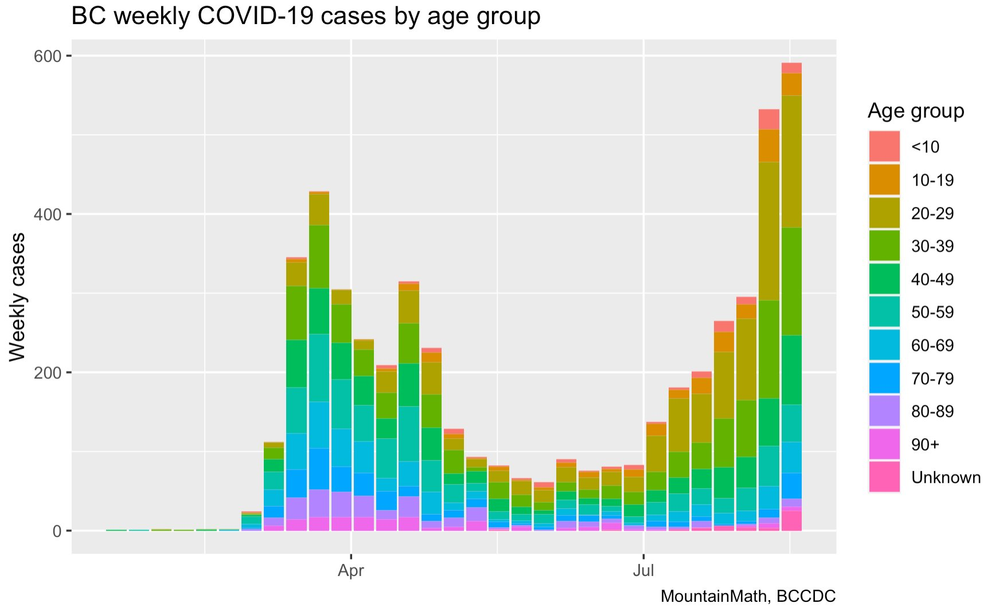
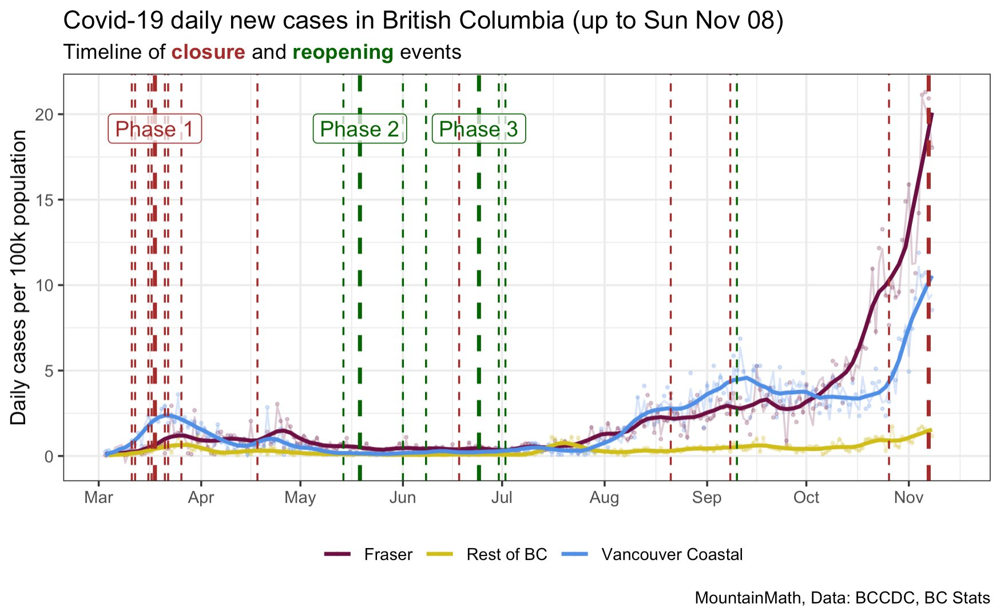

### Libraries Needed

```{r}
library(tidyverse)
library(lubridate)
library(Covid19CanadaData)
library(DT)
library(ggplot2)
library(zoo)
library(scales)
library(viridis)
```

## Introduction {#covid-bc-intro}

As the COVID-19 pandemic transitioned between phases, the number of cases in British Columbia was increasing.

Here are two charts by Jens von Bergmann

From August 25, 2020 showing cases by age group:



-   https://twitter.com/vb_jens/status/1298407214189690880?s=20

From November 9, 2020 showing new cases by Health Authority region, on a "per 100K population" basis:



-   https://twitter.com/vb_jens/status/1325965304925577218?s=20

In this project, your primary goal is to recreate the example graphs provided as .jpg files.

### Other visualizations of data from the same source

https://twitter.com/vb_jens/status/1323423179390418944?s=20

Animations:

https://twitter.com/vb_jens/status/1323649252770291713?s=20

## Data source {#covid-bc-data}

Source: COVID-19 Canada Open Data Working Group

[opencovid.ca GitHub repository](https://github.com/jeanpaulrsoucy/covid-19-canada-gov-data)

## For own research I have made this

Firstly, I did a research on how to get the data from the github link and then assign the data to a variable.

Since I can only find the data online I have searched for a way how to get the link to be linked on RStudio.

here is the video that I watched to learn it "<https://www.youtube.com/watch?v=poTA8HxPqes>".

```{r}
CNCovidData <- "https://raw.githubusercontent.com/ccodwg/CovidTimelineCanada/main/data/pt/cases_pt.csv"
CanadaCovidCases <- read_csv(CNCovidData)

bc_2020_2023 <- CanadaCovidCases %>%
  filter(region == "BC") %>% 
  filter(date >= "2020-01-01" & date <= "2023-12-31")

head(CanadaCovidCases)
```

```{r}
glimpse(CanadaCovidCases)

### I used this one to check on the headers in the CSV file so that I don't have to go back to the link that much
```

## Now we are going to Filter every province

Filtering every province would show that how much Corona Virus affected each provinces in Canada.

So I made a guide here for the progression of Covid in the span of 3 years from 2020-2023.

# Guide

```{r}
BCData <- CanadaCovidCases %>%
  filter(region == "BC") #done

ABData <- CanadaCovidCases %>%
  filter(region == "AB") #done

ONData <- CanadaCovidCases %>%
  filter(region == "ON") #done

QCData <- CanadaCovidCases %>%
  filter(region == "QC") #done

SKData <- CanadaCovidCases %>%
  filter(region == "SK") #done

MBData <- CanadaCovidCases %>%
  filter(region == "MB") #done

NTData <- CanadaCovidCases %>%
  filter(region == "NT") #done

YTData <- CanadaCovidCases %>%
  filter(region == "YT")

PEData <- CanadaCovidCases %>%
  filter(region == "PE")

### a guide for filtering each Province
```

# BC Covid-19 status 2020-2023

I wanted this to be interactive and easy to navigate so I searched this up online and made the code while watching this video. <https://www.youtube.com/watch?v=u7JN2hyH1CU> on how to use DT library.

```{r}
datatable(bc_2020_2023, 
          colnames = c("Date", "Value", "Daily New Cases"),
          caption = "Daily British Columbia COVID-19 Status: 2020 to 2023",
          options = list(pageLength = 10))
```

## BC Graph 2020-2023

```{r}
bc_plot_data <- bc_2020_2023 %>%
  mutate(Year = as.factor(year(date))) 
ggplot(bc_plot_data, aes(x = date, y = value_daily, fill = Year)) +
  geom_col(width = 1) + 
  scale_fill_viridis_d(option = "magma") + 
  theme_grey() + 
  labs(
    title = "BC COVID-19 Cases by Year",
    x = "Date",
    y = "Weekly Cases",
    fill = "Year"
  ) +
  scale_x_date(date_breaks = "4 months", date_labels = "%b %Y") +
  theme(axis.text.x = element_text(angle = 45, hjust = 1))
```

So we have finished the data for BC Covid Cases. Now we move on to Alberta and then Go on Onwards to other terito

# Alberta table 2020-2023 Covid-19 Cases

```{r}
AB2020_2023 <- ABData %>%
  as_tibble() %>%
  filter(date >= "2020-01-01" & date <= "2023-12-31") %>%
  select(date, value, value_daily) %>%
  arrange(date)
```

```{r}
datatable(AB2020_2023, 
          colnames = c("Date", "Value", "Daily New Cases"),
          caption = "Daily Alberta COVID-19 Status: 2020 to 2023",
          options = list(pageLength = 10))
```

## Alberta 2020-2023 Covid-19 Graph

```{r}
ABPlot <- ABData %>%
  as_tibble() %>%
  filter(date >= "2020-01-01" & date <= "2023-12-31") %>%
  mutate(Year = as.factor(year(date)))
```

```{r}
ggplot(ABPlot, aes(x = date, y = value_daily, fill = Year)) +
  geom_col(width = 1) + 
  geom_line(aes(y = rollmean(value_daily, 7, na.pad = TRUE)), 
            color = "white", linewidth = 0.8, alpha = 0.8) +
  scale_fill_viridis_d(option = "viridis") + 
  theme_grey() + 
  labs(
    title = "Alberta COVID-19 Cases (2020-2023)",
    subtitle = "Daily new cases colored by year",
    x = "Date",
    y = "New Cases",
    fill = "Year"
  ) +
  scale_x_date(date_breaks = "6 months", date_labels = "%b %Y") +
  theme(axis.text.x = element_text(angle = 45, hjust = 1))
```

# Manitoba 2020-2023 Covid-19 Cases Table

```{r}
MB2020_2023 <- MBData %>%
  as_tibble() %>%
  filter(date >= "2020-01-01" & date <= "2023-12-31") %>%
  select(date, value, value_daily) %>%
  arrange(date)
```

```{r}
datatable(MB2020_2023, 
          colnames = c("Date", "Value", "Daily New Cases"),
          caption = "Daily Manitoba COVID-19 Status: 2020 to 2023",
          options = list(pageLength = 10))
```

## Manitoba Covid-19 2020-2023 Graph

```{r}
MBPlot <- MBData %>%
  as_tibble() %>%
  filter(date >= "2020-01-01" & date <= "2023-12-31") %>%
  mutate(Year = as.factor(year(date)))
```

```{r}

ggplot(MBPlot, aes(x = date, y = value_daily, fill = Year)) +
  geom_col(width = 1) + 
  geom_line(aes(y = rollmean(value_daily, 7, na.pad = TRUE)), 
            color = "white", linewidth = 0.8, alpha = 0.7) +
  scale_fill_viridis_d(option = "inferno") + 
  theme_grey() + 
  labs(
    title = "Manitoba COVID-19 Cases (2020-2023)",
    subtitle = "Daily new cases with 7-day rolling average",
    x = "Date",
    y = "New Cases",
    fill = "Year"
  ) +
  scale_x_date(date_breaks = "6 months", date_labels = "%b %Y") +
  theme(axis.text.x = element_text(angle = 45, hjust = 1))
```

## Ontario Covid-19 Cases 2020-2023 Data Table

```{r}
ON2020_2023 <- ONData %>%
  as_tibble() %>%
  filter(date >= "2020-01-01" & date <= "2023-12-31") %>%
  select(date, value, value_daily) %>%
  arrange(date)
```

```{r}
datatable(ON2020_2023, 
          colnames = c("Date", "Value", "Daily New Cases"),
          caption = "Daily Ontario COVID-19 Status: 2020 to 2023",
          options = list(pageLength = 10))
```

## Ontario Covid-19 Graph 2020-2023

```{r}
ONPlot <- ONData %>%
  as_tibble() %>%
  filter(date >= "2020-01-01" & date <= "2023-12-31") %>%
  mutate(Year = as.factor(year(date)))
```

```{r}
ggplot(ONPlot, aes(x = date, y = value_daily, fill = Year)) +
  geom_col(width = 1) + 
  geom_line(aes(y = rollmean(value_daily, 7, na.pad = TRUE)), 
            color = "white", linewidth = 0.8, alpha = 0.7) +
  scale_fill_viridis_d(option = "plasma") + 
  theme_grey() + 
  labs(
    title = "Ontario COVID-19 Cases (2020-2023)",
    subtitle = "Daily new cases with 7-day rolling average",
    x = "Date",
    y = "New Cases",
    fill = "Year"
  ) +
  scale_x_date(date_breaks = "6 months", date_labels = "%b %Y") +
  theme(axis.text.x = element_text(angle = 45, hjust = 1))
```

I didn't expect it to be this high too. So Let's move on to Saskatchewan!!

## Saskatechewan Covid-19 2020-2023 Data Table

```{r}
SK2020_2023 <- SKData %>%
  as_tibble() %>%
  filter(date >= "2020-01-01" & date <= "2023-12-31") %>%
  select(date, value, value_daily) %>%
  arrange(date)
```

```{r}
datatable(SK2020_2023, 
          colnames = c("Date", "Value", "Daily New Cases"),
          caption = "Daily Saskatchewan COVID-19 Status: 2020 to 2023",
          options = list(pageLength = 10))
```

## Saskatchewan Covid-19 2020-2023 Graph

```{r}
SKPlot <- SKData %>%
  as_tibble() %>%
  filter(date >= "2020-01-01" & date <= "2023-12-31") %>%
  mutate(Year = as.factor(year(date)))
```

```{r}
ggplot(SKPlot, aes(x = date, y = value_daily, fill = Year)) +
  geom_col(width = 1) + 
  geom_line(aes(y = rollmean(value_daily, 7, na.pad = TRUE)), 
            color = "white", linewidth = 0.8, alpha = 0.7) +
  scale_fill_viridis_d(option = "cividis") + 
  theme_grey() + 
  labs(
    title = "Saskatchewan COVID-19 Cases (2020-2023)",
    subtitle = "Daily new cases with 7-day rolling average",
    x = "Date",
    y = "New Cases",
    fill = "Year"
  ) +
  scale_x_date(date_breaks = "6 months", date_labels = "%b %Y") +
  theme(axis.text.x = element_text(angle = 45, hjust = 1))
```

## Quebec Covid-19 2020-2023 data table 

```{r}
QC2020_2023 <- QCData %>%
  as_tibble() %>%
  filter(date >= "2020-01-01" & date <= "2023-12-31") %>%
  select(date, value, value_daily) %>%
  arrange(date)
```

```{r}
datatable(SK2020_2023, 
          colnames = c("Date", "Value", "Daily New Cases"),
          caption = "Daily Quebec COVID-19 Status: 2020 to 2023",
          options = list(pageLength = 10))
```

## Quebec Covid-19 2020-2023 Graph

```{r}
QCPlot <- QCData %>%
  as_tibble() %>%
  filter(date >= "2020-01-01" & date <= "2023-12-31") %>%
  mutate(Year = as.factor(year(date)))
```

```{r}
ggplot(QCPlot, aes(x = date, y = value_daily, fill = Year)) +
  geom_col(width = 1) + 
  geom_line(aes(y = rollmean(value_daily, 7, na.pad = TRUE)), 
            color = "white", linewidth = 0.8, alpha = 0.7) +
  scale_fill_viridis_d(option = "rocket") + 
  theme_grey() + 
  labs(
    title = "Quebec COVID-19 Cases (2020-2023)",
    subtitle = "Daily new cases with 7-day rolling average",
    x = "Date",
    y = "New Cases",
    fill = "Year"
  ) +
  scale_x_date(date_breaks = "6 months", date_labels = "%b %Y") +
  theme(axis.text.x = element_text(angle = 45, hjust = 1))
```

## North West Territories Covid-19 2020-2023 Data Table

```{r}
NT2020_2023 <- NTData %>%
  as_tibble() %>%
  filter(date >= "2020-01-01" & date <= "2023-12-31") %>%
  select(date, value, value_daily) %>%
  arrange(date)
```

```{r}
datatable(NT2020_2023, 
          colnames = c("Date", "Value", "Daily New Cases"),
          caption = "Daily North West Territories COVID-19 Status: 2020 to 2023",
          options = list(pageLength = 10))
```

## North West Territories Covid-19 2020-2023 Graph

```{r}
NTPlot <- NTData %>%
  as_tibble() %>%
  filter(date >= "2020-01-01" & date <= "2023-12-31") %>%
  mutate(Year = as.factor(year(date)))
```

```{r}
ggplot(NTPlot, aes(x = date, y = value_daily, fill = Year)) +
  geom_col(width = 1) + 
  geom_line(aes(y = rollmean(value_daily, 7, na.pad = TRUE)), 
            color = "skyblue", linewidth = 0.8, alpha = 0.8) +
  scale_fill_viridis_d(option = "mako") + 
  theme_grey() + 
  labs(
    title = "Northwest Territories COVID-19 Cases (2020-2023)",
    subtitle = "Daily new cases with 7-day rolling average",
    x = "Date",
    y = "New Cases",
    fill = "Year"
  ) +
  scale_x_date(date_breaks = "6 months", date_labels = "%b %Y") +
  theme(axis.text.x = element_text(angle = 45, hjust = 1))
```

# Yukon Covid-19 2020-2023 Data Table

```{r}
YT2020_2023 <- YTData %>%
  as_tibble() %>%
  filter(date >= "2020-01-01" & date <= "2023-12-31") %>%
  select(date, value, value_daily) %>%
  arrange(date)
```

```{r}
datatable(YT2020_2023, 
          colnames = c("Date", "Value", "Daily New Cases"),
          caption = "Daily Yukon COVID-19 Status: 2020 to 2023",
          options = list(pageLength = 10))
```

## Yukon Covid-19 2020-2023 Graph

```{r}
YTPlot <- YTData %>%
  as_tibble() %>%
  filter(date >= "2020-01-01" & date <= "2023-12-31") %>%
  mutate(Year = as.factor(year(date)))
```

```{r}
ggplot(YTPlot, aes(x = date, y = value_daily, fill = Year)) +
  geom_col(width = 1) + 
  geom_line(aes(y = rollmean(value_daily, 7, na.pad = TRUE)), 
            color = "white", linewidth = 0.8, alpha = 0.8) +
  scale_fill_viridis_d(option = "turbo") + 
  theme_grey() + 
  labs(
    title = "Yukon COVID-19 Cases (2020-2023)",
    subtitle = "Daily new cases with 7-day rolling average",
    x = "Date",
    y = "New Cases",
    fill = "Year"
  ) +
  scale_x_date(date_breaks = "6 months", date_labels = "%b %Y") +
  theme(axis.text.x = element_text(angle = 45, hjust = 1))
```

Lastly, We'll go on to Prince Edward and then we'll make a graph for the whole Canada Covid progression status.

## Prince Edward Covid-19 2020-2023 Data table

```{r}
PE2020_2023 <- PEData %>%
  as_tibble() %>%
  filter(date >= "2020-01-01" & date <= "2023-12-31") %>%
  select(date, value, value_daily) %>%
  arrange(date)
```

```{r}
datatable(PE2020_2023, 
          colnames = c("Date", "Value", "Daily New Cases"),
          caption = "Daily Prince Edward COVID-19 Status: 2020 to 2023",
          options = list(pageLength = 10))
```

## Prince Edward Covid-19 2020-2023 Graph

```{r}
PEPlot <-PEData %>%
  as_tibble() %>%
  filter(date >= "2020-01-01" & date <= "2023-12-31") %>%
  mutate(Year = as.factor(year(date)))
```

```{r}
ggplot(PEPlot, aes(x = date, y = value_daily, fill = Year)) +
  geom_col(width = 1) + 
  geom_line(aes(y = rollmean(value_daily, 7, na.pad = TRUE)), 
            color = "white", linewidth = 0.8, alpha = 0.8) +
  scale_fill_viridis_d(option = "cividis") + 
  theme_grey() + 
  labs(
    title = "Prince Edward Island COVID-19 Cases (2020-2023)",
    subtitle = "Daily new cases with 7-day rolling average",
    x = "Date",
    y = "New Cases",
    fill = "Year"
  ) +
  scale_x_date(date_breaks = "6 months", date_labels = "%b %Y") +
  theme(axis.text.x = element_text(angle = 45, hjust = 1))
```

### Now we have filtered Each Province

We can see that the most affected by Covid was Ontario and the least is Yukon.

And the question on why I did a data table and graph for each province?

Yes, I am making each table and graph to see the progression of Corona virus in each provinces in Canada. I have heard from my professor on my last semester that BC did a great strategy on dealing Corona Virus in its peak progression year

# Let's make a Table for the whole Canada

```{r}
Canada2020_2023 <- CanadaCovidCases %>%
  as_tibble() %>%
  group_by(date) %>%
  summarize(
    total_cases = sum(value, na.rm = TRUE),
    daily_new_cases = sum(value_daily, na.rm = TRUE)
  ) %>%
  filter(date >= "2020-01-01" & date <= "2023-12-31") %>%
  arrange(date)
```

```{r}
datatable(Canada2020_2023, 
          rownames = FALSE,
          colnames = c("Date", "Total National Cases", "Daily National New Cases"),
          caption = "Daily Canada National COVID-19 Status: 2020 to 2023",
          options = list(pageLength = 10))
```

# Canada Covid-19 2020-2023 Graph

I would make a different

```{r}
CanadaConsistent <- CanadaCovidCases %>%
  as_tibble() %>%
  filter(date >= "2020-03-01" & date <= "2023-12-31") %>%
  mutate(Year = factor(format(date, "%Y"))) %>%
  group_by(date, name, Year) %>%
  summarize(daily_cases = sum(value_daily, na.rm = TRUE), .groups = 'drop') %>%
  group_by(name) %>%
  mutate(smooth_cases = rollmean(daily_cases, 7, fill = NA))
```

```{r}
ggplot(CanadaConsistent, aes(x = date, y = daily_cases, fill = daily_cases)) +
  geom_col(width = 1) +
  geom_line(aes(y = smooth_cases), color = "white", linewidth = 0.8, alpha = 0.8) +
  scale_fill_viridis_c(option = "inferno", labels = label_comma()) + 
  theme_minimal() +
  labs(
    title = "Heat Map: COVID-19 Case Intensity in Canada",
    subtitle = "Color intensity represents daily new case volume",
    x = "Date",
    y = "New Cases",
    fill = "Case Count"
  ) +
  theme(
    legend.position = "right",
    plot.title = element_text(face = "bold", size = 14),
    axis.text.x = element_text(angle = 45, hjust = 1)
  ) +
  scale_x_date(date_breaks = "6 months", date_labels = "%b %Y")
```

To choose colors if anybody would see this. I have watched this video on youtube <https://www.youtube.com/watch?v=iXkk_H7k418>

and to make the counts prettier instead of 50000 it displayed 50,000

I have used scales library as guided on this video

<https://www.youtube.com/watch?v=4DpktFAluCY&list=PLu6UwBFCnlEdWXwX5NGexQ3_aDzPcYaMg>

That would be all to my capstone project and hopefully everyone enjoyed this and learn from these videos how I'd learn it throughout this course.

# Thank you!
